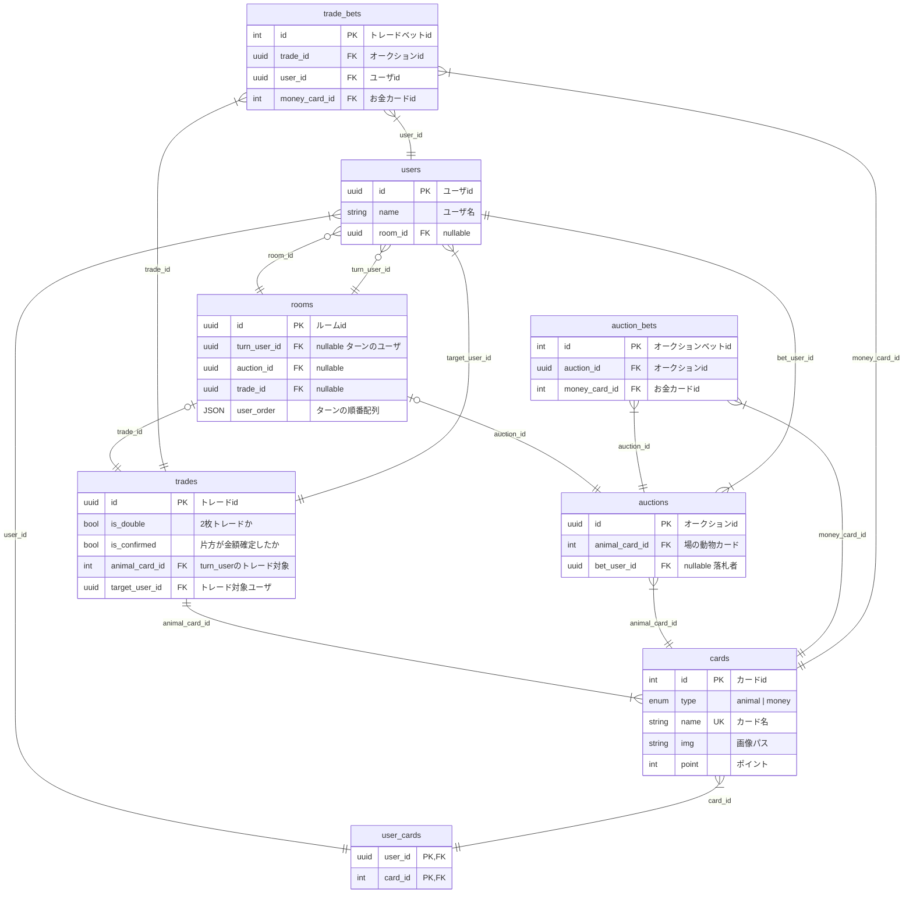

```mermaid
erDiagram
    users o{--|| rooms : "room_id"
    rooms ||--o{ users : "turn_user_id"
    users |{--|| user_cards : "user_id"
    cards |{--|| user_cards : "card_id"
    rooms o|--|| auctions : "auction_id"
    rooms o|--|| trades : "trade_id"
    trades ||--|{ cards : "animal_card_id"
    trades ||--|{ users : "target_user_id"
    auctions |{--|| cards : "animal_card_id"
    auctions |{--|| users : "bet_user_id"
    auction_bets |{--|| auctions : "auction_id"
    auction_bets |{--|| cards : "money_card_id"
    trade_bets |{--|| trades : "trade_id"
    trade_bets |{--|| users : "user_id"
    trade_bets |{--|| cards : "money_card_id"

    users {
        uuid id PK "ユーザid"
        string name "ユーザ名"
        uuid room_id FK "nullable"
    }

    user_cards {
        uuid user_id PK,FK
        int card_id PK,FK
    }

    cards {
        int id PK "カードid"
        enum type "animal | money"
        string name UK "カード名"
        string img "画像パス"
        int point "ポイント"
    }

    rooms {
        uuid id PK "ルームid"
        uuid turn_user_id FK "nullable ターンのユーザ"
        uuid auction_id FK "nullable"
        uuid trade_id FK "nullable"
        JSON user_order "ターンの順番配列"
    }

    auctions {
        uuid id PK "オークションid"
        int animal_card_id FK "場の動物カード"
        uuid bet_user_id FK "nullable 落札者"
    }

    auction_bets {
        int id PK "オークションベットid"
        uuid auction_id FK "オークションid"
        int money_card_id FK "お金カードid"
    }

    trades {
        uuid id PK "トレードid"
        bool is_double "2枚トレードか"
        bool is_confirmed "片方が金額確定したか"
        int animal_card_id FK "turn_userのトレード対象"
        uuid target_user_id FK "トレード対象ユーザ"
    }

    trade_bets{
        int id PK "トレードベットid"
        uuid trade_id FK "オークションid"
        uuid user_id FK "ユーザid"
        int money_card_id FK "お金カードid"
    }
```
