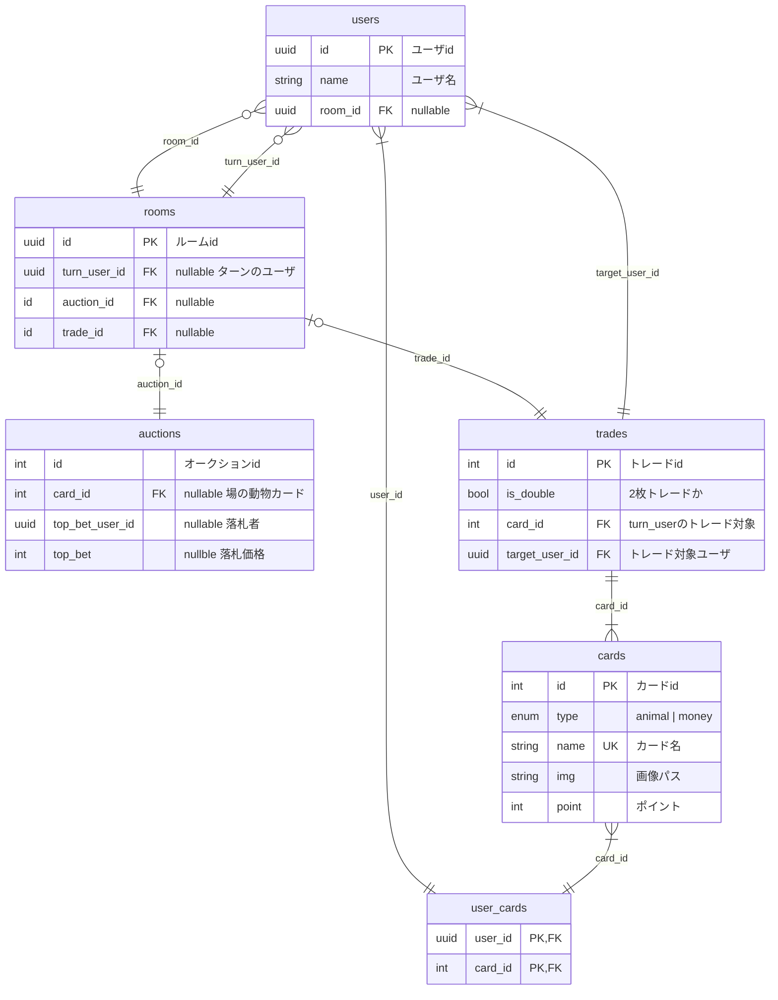

```mermaid
erDiagram
    users o{--|| rooms : "room_id"
    rooms ||--o{ users : "turn_user_id"
    users |{--|| user_cards : "user_id"
    cards |{--|| user_cards : "card_id"
    rooms o|--|| auctions : "auction_id"
    rooms o|--|| trades : "trade_id"
    trades ||--|{ cards : "card_id"
    trades ||--|{ users : "target_user_id"

    users {
        uuid id PK "ユーザid"
        string name "ユーザ名"
        uuid room_id FK "nullable"
    }

    user_cards {
        uuid user_id PK,FK
        int card_id PK,FK
    }

    cards {
        int id PK "カードid"
        enum type "animal | money"
        string name UK "カード名"
        string img "画像パス"
        int point "ポイント"
    }

    rooms {
        uuid id PK "ルームid"
        uuid turn_user_id FK "nullable ターンのユーザ"
        id auction_id FK "nullable"
        id trade_id FK "nullable"
    }

    trades {
        int id PK "トレードid"
        bool is_double "2枚トレードか"
        int card_id FK "turn_userのトレード対象"
        uuid target_user_id FK "トレード対象ユーザ"
    }

    auctions {
        int id "オークションid"
        int card_id FK "nullable 場の動物カード"
        uuid top_bet_user_id "nullable 落札者"
        int top_bet "nullble 落札価格"
    }
```
