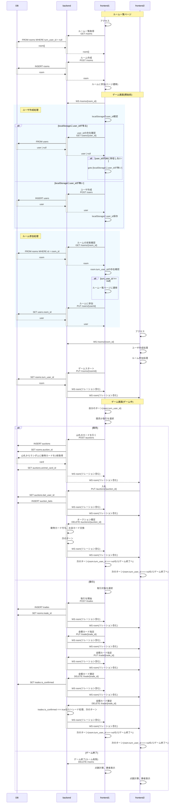

```mermaid
sequenceDiagram
    participant d as DB
    participant b as backend
    participant f1 as frontend1
    participant f2 as frontend2

    Note over f1,f2: ルーム一覧ページ
    f1->>f1: アクセス
    f1->>+b: ルーム一覧取得<br>GET /rooms
    b->>+d: FROM rooms WHERE turn_user_id = null
    d-->>-b: room[]
    b-->>-f1: room[]
    f1->>+b: ルーム作成<br/>POST /rooms
    b->>+d: INSERT rooms
    d-->>-b: room
    b-->>-f1: room
    f1->>f1: ルームに参加(ページ遷移)

    Note over f1,f2: ゲーム画面(開始前)
    f1->>b: WS /rooms/{room_id}
    rect rgb(240, 250, 255)
    note right of d: ユーザ作成処理
    f1->>f1: localStorageのuser_id確認
    alt localStorageにuser_idが有る
        f1->>+b: user_idの存在確認<br/>GET /users/{user_id}
        b->>+d: FROM users
        d-->>-b: user | null
        b-->>-f1: user | null
        alt user_idがDBに存在しない
            f1->>f1: goto [localStorageにuser_idが無い]
        end
    else localStorageにuser_idが無い
        f1->>+b: ユーザ作成<br/>POST /users
        b->>+d: INSERT users
        d-->>-b: user
        b-->>-f1: user
        f1->>f1: localStorageにuser_id保存
    end
    end
    rect rgb(240, 250, 255)
    note right of d: ルーム参加処理
    f1->>+b: ルームの状態確認<br/>GET /rooms/{room_id}
    b->>+d: FROM rooms WHERE id = room_id
    d-->>-b: room
    b-->>-f1: room
    f1->>f1: room.turn_user_idの存在確認
    alt turn_user_id !== null
        f1->>f1: ルーム一覧ページに遷移
    end
    f1->>+b: ルームに参加<br/>PUT /users/{userId}
    b->>+d: SET users.room_id
    d-->>-b: user
    b-->>-f1: user
    end
    f2->>f2: アクセス
    f2->>b: WS /rooms/{room_id}
    f2->>f2: ユーザ作成処理
    f2->>f2: ルーム参加処理
    f1->>+b: ゲームスタート<br/>PUT /rooms/{roomId}
    b->>+d: SET rooms.turn_user_id
    d->>-b: room
    b->>f1: WS room(リレーション含む)
    b->>-f2: WS room(リレーション含む)

    Note over f1,f2: ゲーム画面(ゲーム中)
    f1->>f1: 自分のターン(room.turn_user_id)
    f1->>f1: 競売か取引を選択
    alt 競売
        f1->>+b: 山札のカードを引く<br/>POST /auctions
        b->>d: INSERT auctions
        b->>d: SET rooms.auction_id
        b->>+d: 山札からランダムに動物カードを1枚取得
        d-->>-b: card
        b->>d: SET auctions.animel_card_id
        b-->>f1: WS room(リレーション含む)
        b-->>-f2: WS room(リレーション含む)
        f2->>+b: 入札<br/>PUT /auctions/{auction_id}
        b->>d: SET auctions.bet_user_id
        b->>d: INSERT auction_bets
        b->>f1: WS room(リレーション含む)
        b->>-f2: WS room(リレーション含む)
        f1->>+b: オークション確定<br/>DELETE /auctions/{auction_id}
        b->>b: 動物カード付与、お金カード交換
        b->>b: 次のターン
        b->>f1: WS room(リレーション含む)
        b->>-f2: WS room(リレーション含む)
        f1->>f1: 次のターン(room.turn_user_id === nullならゲーム終了へ)
        f2->>f2: 次のターン(room.turn_user_id === nullならゲーム終了へ)
    else 取引
        f1->>f1: 取引対象を選択
        f1->>+b: 取引を開始<br/>POST /trades
        b->>d: INSERT trades
        b->>d: SET rooms.trade_id
        b->>f1: WS room(リレーション含む)
        b->>-f2: WS room(リレーション含む)
        f1->>+b: 金額カード指定<br/>PUT /trade/{trade_id}
        b->>f1: WS room(リレーション含む)
        b->>-f2: WS room(リレーション含む)
        f2->>+b: 金額カード指定<br/>PUT /trade/{trade_id}
        b->>f1: WS room(リレーション含む)
        b->>-f2: WS room(リレーション含む)
        f1->>+b: 金額カード確定<br/>DELETE /trade/{trade_id}
        b->>d: SET trades.is_confirmed
        b->>f1: WS room(リレーション含む)
        b->>-f2: WS room(リレーション含む)
        f2->>+b: 金額カード確定<br/>DELETE /trade/{trade_id}
        b->>b: trades.is_confirmed === trueならトレード処理、次のターン
        b->>f1: WS room(リレーション含む)
        b->>-f2: WS room(リレーション含む)
        f1->>f1: 次のターン(room.turn_user_id === nullならゲーム終了へ)
        f2->>f2: 次のターン(room.turn_user_id === nullならゲーム終了へ)
    else ゲーム終了
        f1->>b: ゲーム終了(ルーム削除)<br/>DELETE /rooms
        f1->>f1: 点数計算、勝者表示
        f2->>f2: 点数計算、勝者表示
    end
```
